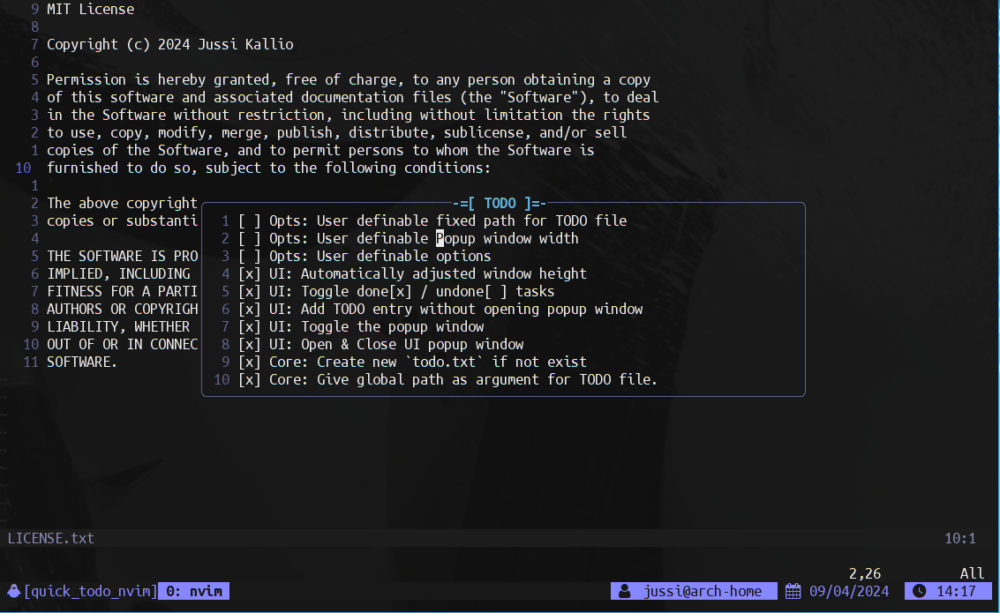

<div align="center">

# Quick TODO

Create a simple TODO list for your project quickly.

[](http://www.lua.org)
[](https://neovim.io)

</div>

## Description

This plugin for [Neovim](https://neovim.io) allows you to quickly manage your tasks by creating a `todo.txt` file in your current working directory. You can then edit the TODO items without having to open the file by using the specially designed popup window.

## Features

- [x] Creates a `todo.txt` file automatically in your current working directory. (Alternatively you can specify the path).
- [x] Add entries directly into file without opening the popup window.
- [x] Simple and intuitive interface.
- [x] Toggle a entry as done [x] or not done [ ] with Return key (in *Normal* mode)

## Usage

```lua
local todo = require('quick-todo')
todo.setup(opts) -- Setup the plugin with optional arguments
todo.open_ui() -- Open the popup UI using default path
todo.open_ui({use_fixed_path=true}) -- Open the popup UI using fixed path (defined in the configuration)
todo.open_ui_with_path({path='path/to/file'}) -- Open the popup UI using given path
todo.close_ui() -- Close the popup UI
todo.toggle_ui() -- Toggle the popup UI
todo.add() -- Add TODO entry into the default todo file
todo.add({use_fixed_path=true}) -- Add TODO entry using the fixed path
```

### Installation

Using [vim-plug](https://github.com/junegunn/vim-plug)
```vim
Plug 'nvim-lua/plenary.nvim' " Required dependency
Plug 'jkallio/quick-todo.nvim'
```

Using [packer](https://github.com/wbthomason/packer.nvim)
```lua
use {
  'jkallio/quick-todo.nvim',
  requires = { {'nvim-lua/plenary.nvim'} }
}
```

Using [lazy](https://github.com/folke/lazy.nvim)
```lua
return {
    {
    'jkallio/quick-todo.nvim',
      dependencies = { 'nvim-lua/plenary.nvim' }
    }
}
```

### Configuration

e.g. Using [lazy](https://github.com/folke/lazy.nvim):
```lua
return {
  'jkallio/quick-todo.nvim',
  dependencies = {
    "nvim-lua/plenary.nvim",
  },
  config = function()
    local todo = require('quick-todo')
    todo.setup({
        -- Path to the fixed todo file
        fixed_path = '/path/to/todo.txt',
        -- Always use fixed path. If false, the plugin will create a todo file in the current working directory
        use_fixed_path = false,
        -- Popup window width in percentage
        width = '50',
    })

    vim.keymap.set('n', '<leader>ta', todo.add, { desc = 'quick-todo: Add new entry' })
    vim.keymap.set('n', '<leader>tt', todo.toggle_ui, { desc = 'quick-todo: toggle popup UI' })
    vim.keymap.set('n', '<leader>tg', function() todo.open_ui({use_fixed_path=true}) end, { desc = 'quick-todo: Open TODO using fixed path' })
    vim.keymap.set('n', '<leader>tp', function() todo.open_ui_with_path({path='/path/to/todo.txt'}) end, { desc = 'quick-todo: Open TODO using specifed path' })
  end
}
```

### Screenshots


